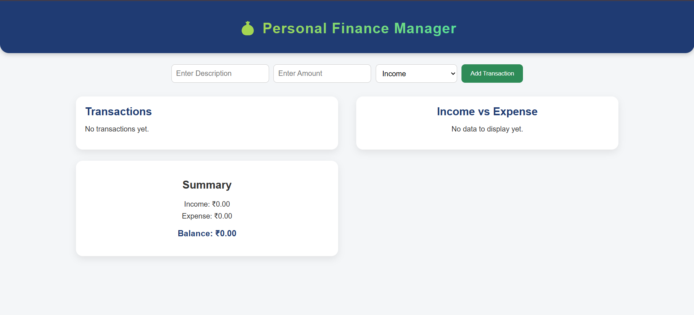
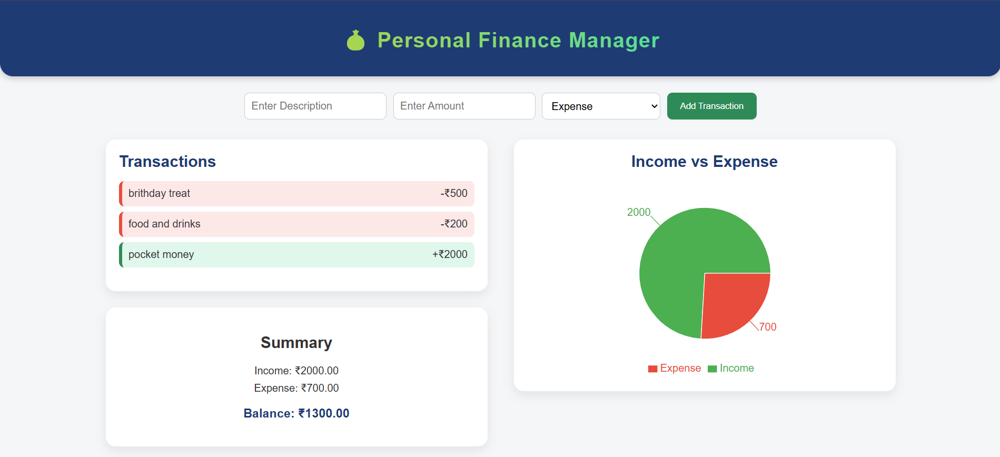

# Personal Finance Tracker 💰

A modern, responsive personal finance tracking application built with React, Vite, and Recharts. Track your income, expenses, and visualize your financial data with beautiful charts.


## ✨ Features

- 📊 **Interactive Dashboard** - View your financial overview at a glance
- 💵 **Income & Expense Tracking** - Add, edit, and delete transactions easily
- 📈 **Visual Analytics** - Beautiful pie charts and bar graphs using Recharts
- 🎨 **Modern UI** - Clean, responsive design with Tailwind CSS
- 💾 **Local Storage** - All data persists in your browser
- 📱 **Mobile Friendly** - Works seamlessly on all devices
- 🌙 **Dark Mode Support** - Easy on the eyes (optional feature)


## 📸 Screenshots

| Dashboard View | Analytics View |
|----------------|----------------|
|  |  |

*🖼️ Replace these placeholders with actual screenshots of your project*

## 🛠️ Tech Stack

- **Frontend Framework:** React 18.x
- **Build Tool:** Vite 5.x
- **Styling:** Tailwind CSS
- **Charts:** Recharts
- **Icons:** Lucide React
- **State Management:** React Hooks (useState, useEffect)
- **Storage:** Browser LocalStorage API

## 📋 Prerequisites

Before you begin, ensure you have the following installed:

- **Node.js** (v16 or higher) - [Download here](https://nodejs.org/)
- **npm** (v8 or higher) or **yarn** (v1.22 or higher)
- **Git** - [Download here](https://git-scm.com/)

## 🔧 Installation & Setup

### 1️⃣ Clone the Repository

```bash
git clone https://github.com/yourusername/personal-finance-tracker.git
cd personal-finance-tracker
```

### 2️⃣ Install Dependencies

```bash
npm install
# or
yarn install
```

### 3️⃣ Start Development Server

```bash
npm run dev
# or
yarn dev
```

You'll see output like:
```
VITE v5.x ready in 300ms

➜  Local:   http://localhost:5173/
➜  Network: use --host to expose
```

Open your browser and visit 👉 **http://localhost:5173** 🎉

## 📦 Available Scripts

| Command | Description |
|---------|-------------|
| `npm run dev` | Start development server with hot reload |
| `npm run build` | Create production-ready build |
| `npm run preview` | Preview production build locally |
| `npm run lint` | Run ESLint to check code quality |

## 🏗️ Build for Production

Create an optimized production build:

```bash
npm run build
```

The build files will be generated in the `dist/` folder.

Preview the production build:

```bash
npm run preview
```

Visit **http://localhost:4173** to see the production build.

## 🐳 Docker Support (Optional)

If you prefer using Docker:

### Build Docker Image

```bash
docker build -t personal-finance-tracker .
```

### Run Docker Container

```bash
docker run -p 3000:3000 personal-finance-tracker
```

Then visit 👉 **http://localhost:3000**

## 📁 Project Structure

```
personal-finance-tracker/
├── public/                 # Static assets
│   └── vite.svg
├── src/
│   ├── components/        # React components
│   │   ├── Dashboard.jsx
│   │   ├── TransactionForm.jsx
│   │   ├── TransactionList.jsx
│   │   └── Charts.jsx
│   ├── App.jsx           # Main App component
│   ├── main.jsx          # Entry point
│   ├── index.css         # Global styles
│   └── utils/            # Helper functions
├── .gitignore
├── Dockerfile
├── package.json
├── vite.config.js
├── tailwind.config.js
├── postcss.config.js
└── README.md
```

## 🎯 Usage Guide

### Adding a Transaction

1. Click on **"Add Transaction"** button
2. Select transaction type (Income/Expense)
3. Enter amount and category
4. Add optional description
5. Click **"Save"** to record the transaction

### Viewing Analytics

- Navigate to the **Dashboard** to see your balance summary
- Check the **Charts** section for visual breakdown of expenses
- Filter transactions by date range or category

### Managing Data

- **Edit:** Click the edit icon next to any transaction
- **Delete:** Click the trash icon to remove a transaction
- **Export:** Use the export button to download your data as CSV

## 🌐 Deployment

### Deploy to Vercel

```bash
npm install -g vercel
vercel
```

### Deploy to Netlify

```bash
npm run build
# Then drag and drop the 'dist' folder to Netlify
```

### Deploy to GitHub Pages

```bash
npm run build
npm run deploy
```

## 🤝 Contributing

Contributions are welcome! Please follow these steps:

1. **Fork** the repository
2. Create a new branch (`git checkout -b feature/AmazingFeature`)
3. Commit your changes (`git commit -m 'Add some AmazingFeature'`)
4. Push to the branch (`git push origin feature/AmazingFeature`)
5. Open a **Pull Request**

## 🐛 Bug Reports & Feature Requests

Found a bug or have a feature idea? Please open an issue [here](https://github.com/yourusername/personal-finance-tracker/issues).

## 📄 License

This project is licensed under the **MIT License** - see the [LICENSE](LICENSE) file for details.

```
MIT License

Copyright (c) 2025 Naish Sayed

Permission is hereby granted, free of charge, to any person obtaining a copy
of this software and associated documentation files (the "Software"), to deal
in the Software without restriction, including without limitation the rights
to use, copy, modify, merge, publish, distribute, sublicense, and/or sell
copies of the Software, and to permit persons to whom the Software is
furnished to do so, subject to the following conditions:

The above copyright notice and this permission notice shall be included in all
copies or substantial portions of the Software.

THE SOFTWARE IS PROVIDED "AS IS", WITHOUT WARRANTY OF ANY KIND, EXPRESS OR
IMPLIED, INCLUDING BUT NOT LIMITED TO THE WARRANTIES OF MERCHANTABILITY,
FITNESS FOR A PARTICULAR PURPOSE AND NONINFRINGEMENT. IN NO EVENT SHALL THE
AUTHORS OR COPYRIGHT HOLDERS BE LIABLE FOR ANY CLAIM, DAMAGES OR OTHER
LIABILITY, WHETHER IN AN ACTION OF CONTRACT, TORT OR OTHERWISE, ARISING FROM,
OUT OF OR IN CONNECTION WITH THE SOFTWARE OR THE USE OR OTHER DEALINGS IN THE
SOFTWARE.
```

## 👨‍💻 Author

**Naish Sayed**

- GitHub: [@naishsayed](https://github.com/naishsayed)
- LinkedIn: [Naish Sayed](https://www.linkedin.com/in/naish-sayed)

## 🙏 Acknowledgements

- [React](https://reactjs.org/) - JavaScript library for building user interfaces
- [Vite](https://vitejs.dev/) - Next generation frontend tooling
- [Recharts](https://recharts.org/) - Composable charting library
- [Tailwind CSS](https://tailwindcss.com/) - Utility-first CSS framework
- [Lucide Icons](https://lucide.dev/) - Beautiful & consistent icons
- Open-source community for inspiration and support

## 📊 Project Status

🟢 **Active Development** - This project is actively maintained and open for contributions.

## 💡 Perfect For

- 🎓 **Students** - Great for learning React and modern web development
- 👨‍💻 **Beginners** - Clean code structure and well-documented
- 💼 **Portfolio Projects** - Showcase your full-stack development skills
- 🏢 **Small Businesses** - Manage personal or small business finances

---

<div align="center">

### ⭐ Star this repository if you find it helpful!

**"Track your spending. Grow your savings. Own your future."** 💸

Made with ❤️ by Naish Sayed

</div>
